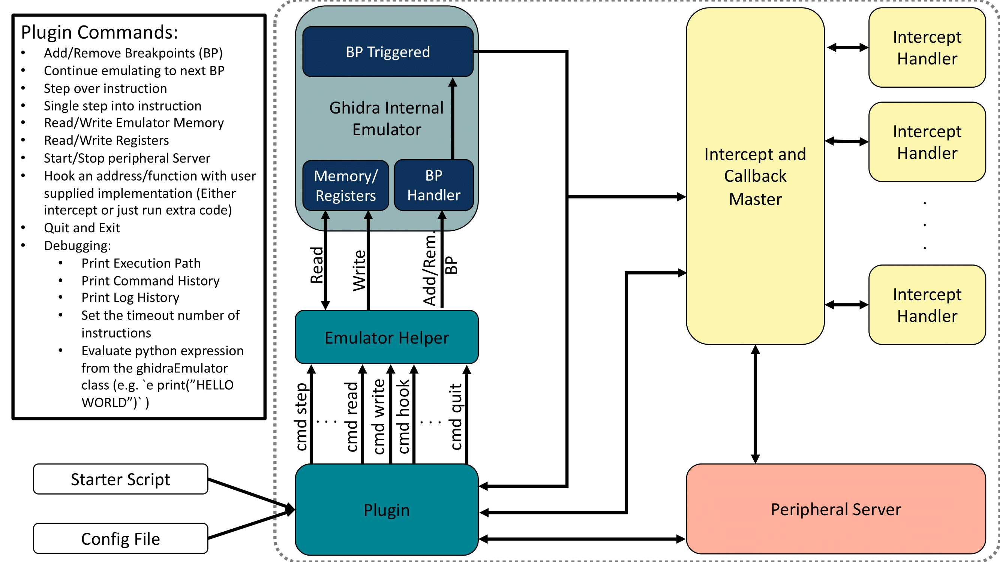

<!-- Copyright 2021 National Technology & Engineering Solutions of Sandia, LLC (NTESS). 
Under the terms of Contract DE-NA0003525 with NTESS, the U.S. Government retains 
certain rights in this software. -->

# About
Ghidra HALucinator Emulator, or GHALdra (gawl-dra), is a Ghidra plugin for doing full or partial 
emulation. This project will use the Ghidra built-in emulator to emulate PCode. We created a plugin and wrapper around the Ghidra Emulator, and allow the user to provide a configuration script to specify functions to hook/intercept and provide user defined functionality, usually in Python code. The design of GHALdra is pictured below:
 

# License

Some of the code from this repository comes from `https://github.com/halucinator/halucinator` (the handlers and some for the bp_handlers and intercepts controllers). Other code has been integrated from `https://github.com/TheRomanXpl0it/ghidra-emu-fun`, though code from both repositories has been substantially changed. We have used the theory and some of the code from HALucinator for doing function hooking with their intercept and peripheral model infrastructure. We took some functionality from ghidra-emu-fun for getting arguments and types from Ghidra. We changed the case to be snake_case for all Python functions, and kept the camlCase for Java/Ghidra API calls that must have that case. This helps differentiate between what is going to Ghidra and what is going to more of our own code and makes it more explicit when reading the code what is happening. the yaml folder here was copied over without any modifications from pyyaml (`https://github.com/yaml/pyyaml`).

# Setup and Requirements:
Download Ghidra from `https://github.com/NationalSecurityAgency/ghidra/releases`. This guide was first setup with 9.2.2, but it also has been tested and setup on 9.2.3, 9.2.4, 10.0.2.
Make sure you have the Java installed and open Ghidra, following their install guide.
```sh
#<first, install Java, then we can do this part>
cd $HOME && mkdir -p Programs && cd Programs
wget https://github.com/NationalSecurityAgency/ghidra/releases/download/Ghidra_10.0.2_build/ghidra_10.0.2_PUBLIC_20210804.zip
unzip ghidra_10.0.2_PUBLIC_20210804.zip
rm ghidra_10.0.2_PUBLIC_20210804.zip
```

After Ghidra works and is linked to Java correctly, we now will enable GHALdra to work.

To make it easier to make this guide work on future/past versions, we assume you will set the `GHIDRA_VERSION` as below
```sh
export GHIDRA_VERSION=ghidra_10.0.2_PUBLIC
```
Make sure GHIDRA_HOME variable is set. I put this in my bashrc, and my ghidra installation is in `$HOME/Programs/`. Something like:
```sh
export GHIDRA_HOME=$HOME/Programs/$GHIDRA_VERSION/
```

For ease of readability, (and for running scripts from commandline using jython outside of Ghidra) the flag `-Dpython.cachedir.skip=false` is added to this alias command:
```sh
alias jython='java -Dpython.cachedir.skip=false -jar $GHIDRA_HOME/Ghidra/Features/Python/lib/jython-standalone-2.7.2.jar'
```

## If you haven't ensured pip for jython:
```sh
jython -m ensurepip
```

## If you have not linked site-packages previously into the right spot, do this. If you have, ignore it:
Now get these site packages to appear where ghidra will look for them
Delete empty folder first, Then link the site-packages to the right spot

```sh
rm $GHIDRA_HOME/Ghidra/Features/Python/data/jython-2.7.2/Lib/site-packages -r
ln -s $GHIDRA_HOME/Ghidra/Features/Python/lib/Lib/site-packages  $GHIDRA_HOME/Ghidra/Features/Python/data/jython-2.7.2/Lib/site-packages
```

## Requires ZMQ (which requires maven to build)
Install maven: 
```sh
sudo apt install maven
```
Then make sure if you are behind a proxy to set the proxy settings in the maven dir settings.xml (usually `/etc/maven/settings.xml`).

Install jeromq (Java only implementation of ZeroMQ)

```sh
cd $HOME && mkdir -p Programs && cd Programs
git clone https://github.com/zeromq/jeromq
cd jeromq
mvn package -Dmaven.test.skip=true -Dmaven.javadoc.skip=true
```

Then export the classes folder of jeromq, probably put it in your bashrc (you may need to change the path if you didn't git clone to this same path):
```sh
export LD_LIBRARY_PATH=$LD_LIBRARY_PATH:$HOME/Programs/jeromq/target/classes
```

Then we need to do a few other things so ghidra finds it correctly too:
```sh
mkdir -p $HOME/.ghidra/.$GHIDRA_VERSION/plugins/
cp $HOME/Programs/jeromq/target/jeromq-0.5.3-SNAPSHOT.jar $HOME/.ghidra/.$GHIDRA_VERSION/plugins/
cp $HOME/Programs/jeromq/target/jeromq-0.5.3-SNAPSHOT.jar $GHIDRA_HOME/Ghidra/patch/
```

# Notes for General Jython packages and Java Packages:
You can install most packages using `jython -m pip install x`, but if the module uses C Modules, it will not install correctly. You may need to download the project, because if you use the `setup.py` from the project, most of the time there is an option to build without C Modules.

You can also add the Java libraries you need by adding the path to LD_LIBRARY_PATH. If you need to add a .jar for your java scripts to run (not sure if the jython will pick them up or not), you can copy the jar to the hidden folder plugins, usually at `$HOME/.ghidra/.$GHIDRA_VERSION/plugins/` as well as to `$GHIDRA_HOME/Ghidra/patch/`

## YAML
yaml files are included as a folder inside of GHALdra so you don't have to do this, but you may want yaml for your other projects or an updated version:
`jython -m pip install pyyaml --global-option=--without-libyaml`
If this fails, try:
`jython -m easy_install pyyaml` 
If this also fails, download pyyaml and cd to the directory of the downloaded pyyaml

```sh
git clone https://github.com/yaml/pyyaml.git
cd pyyaml
jython setup.py --without-libyaml install
```

# RUNNING EXAMPLE:
After doing the setup, we can do some testing to make sure it works and play a bit:

In this example, the firmware will communicate over UART to the user and ask for 10 characters. We don't have the actual hardware that this runs on, so we will provide the firmware with responses it is expecting and skip over hardware address accesses. We do this by providing a Python implementation of UART. We will open a terminal and run the UART `device` that will communicate with the firmware in Ghidra. To do this:

Open up a terminal, and if you don't have the following line in your bashrc, go ahead and do this:
```sh
alias jython='java -Dpython.cachedir.skip=false -jar $GHIDRA_HOME/Ghidra/Features/Python/lib/jython-standalone-2.7.2.jar'
```

Now, cd to the GHALdra directory, and we are going to run the following command:
```sh
cd <path/to/GHALdra>
jython halucinator/external_devices/uart.py -i=1048896
```
(Yes it is slashes, not periods between them, Jython with Ghidra and modules does not work the same way as Python with the modules)
This will start a uart device, you can explore the code at `GHALdra/halucinator/external_devices/uart.py`.

Now that we have our external device running, we go to Ghidra.


Open up Ghidra:
```sh
$GHIDRA_HOME/ghidraRun
```
Now create a new project
`File->New Project`, then follow the prompts of where to save the project
Now import our test file
`File->Import File...` and navigate to `GHALdra/tests_examples/STM32/firmware` and select the `Uart_Hyperterminal_IT_O0.elf` file.
Click `OK` and `OK` again to acknowledge the import. Double click on the `Uart_Hyperterminal_IT_O0.elf` in the Ghidra view.

This will open up the file, and it will ask you if you want to analyze the file. Go ahead and say yes, and use the default auto analysis.
Click on the Script Manager button (green play on the top toolbar), and in the Filter box, type in `ghaldra`. Select the `ghaldra_start.py` and select `Run Script` (the green play). If it is the first time you have ever run GHALdra, it may take a few seconds for a new plugin window to pop up. After this pops up, I usually will dock the window right below the Listing (drag the Blue part of the window where it says GHALdra and dock it).

Inside the GHALdra plugin, we will click the `Start` button. This will ask if you have a config file or not. If you select `No`, it will ask you a series of options you want that are required to run GHALdra. In our case we do have a config file, so we will select `Yes`. It will then ask you to `Enter path to Config File`. We will enter the FULL path to `<path/to/GHALdra>/tests_examples/STM32/ghaldra_stm32.yaml` and press `OK`. It may take a second, but inside the Console-Scripting you will see a bunch of things have happened. We have done some hooking of some functions!

Now we can run the actual firmware. There are multiple command options for GHALdra, but I am going to leave most of them out of this example. To see all the command options, you can type `h` into the command box and press enter, and the options will print in the Console-Scripting.

In the GHALdra window, you should see `Started @ main` commont on the left, above the input box. We will click inside the input box, and then type `c` and then press enter. You will see some coloring happening in the Listing window and it will move around in the Decompile and Listing Windows, and it will be paused at `0x08000bf0`, waiting for input from the UART device that we started in the terminal. So, navigate to the terminal, and you will see that it says:

` ****UART-Hyperterminal communication based on IT ****
 Enter 10 characters using keyboard :`

You can type any characters you want, and press enter. If you don't enter at least 10 characters, it won't do anything in the terminal, but in Ghidra you will see that it says that it go an rx_data message. After you type at least 10 characters total and press enter, Ghidra will unblock and continue execution, using the 10 characters that were sent from the uart script. It will then echo the 10 characters back to the UART in the terminal. We now see in Ghidra that we get to a do-while inifinite loop and the firmware is finished executing.

We can either press `Quit` on the plugin, or if we want to run it again, we can press `Start` again and it will ask for a config file again. The way the uart is written, it will stay open and connected until you finish and example and press enter in the terminal or ctrl-c.


# EXAMPLE 2:
In `tests_examples/test_simple/` you will find a Makefile. To build the binaries, type `make`. This requires you have `gcc-aarch64-linux-gnu` and `gcc-9-arm-linux-gnueabihf`. If you don't have them:

```sh
# to make on Ubuntu, requires:
sudo apt install gcc-aarch64-linux-gnu
sudo apt-get install gcc-9-arm-linux-gnueabihf 
```

You can import the files to Ghidra and for the aarch64.out you can use the `tests_examples/test_simple/options.yaml` as the starting config to play around with.
